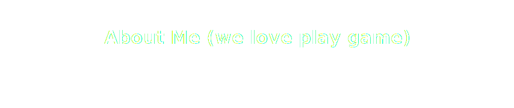

---
平行向量是一家新兴的人工智能公司，专注于利用最先进的**人工智能技术**，为各行各业提供智能化解决方案。
我们的团队由一群富有创新精神和专业知识的人才组成，他们致力于研究和开发人工智能技术，以解决现实世界中的复杂问题。
我们的产品和服务包括但不限于**自然语言处理、机器学习、深度学习、计算机视觉**等领域。我们的目标是通过我们的技术和服务，帮助客户提高效率，降低成本，实现业务的快速发展和创新。

